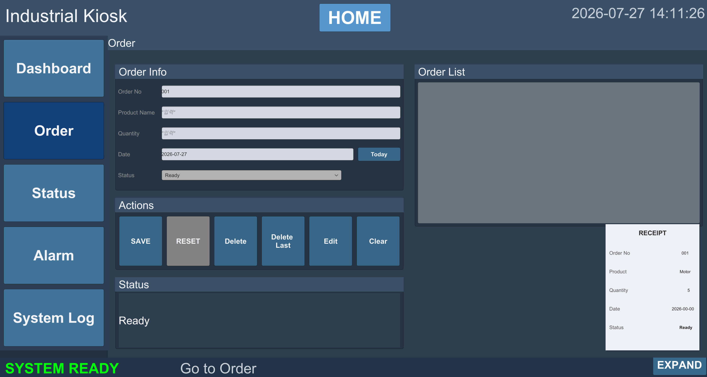
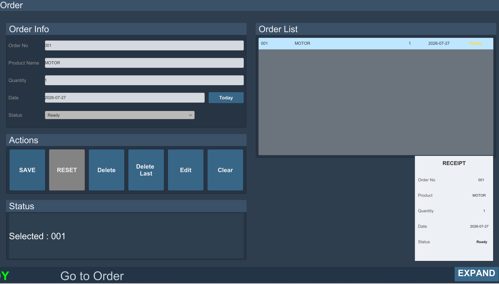
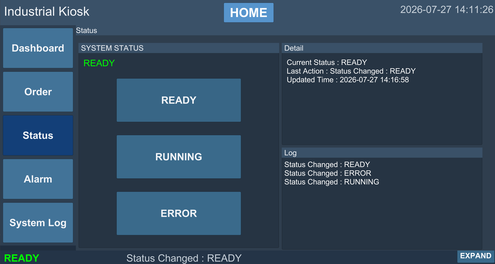
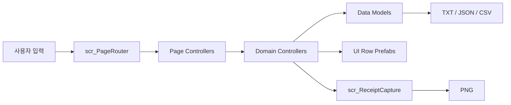
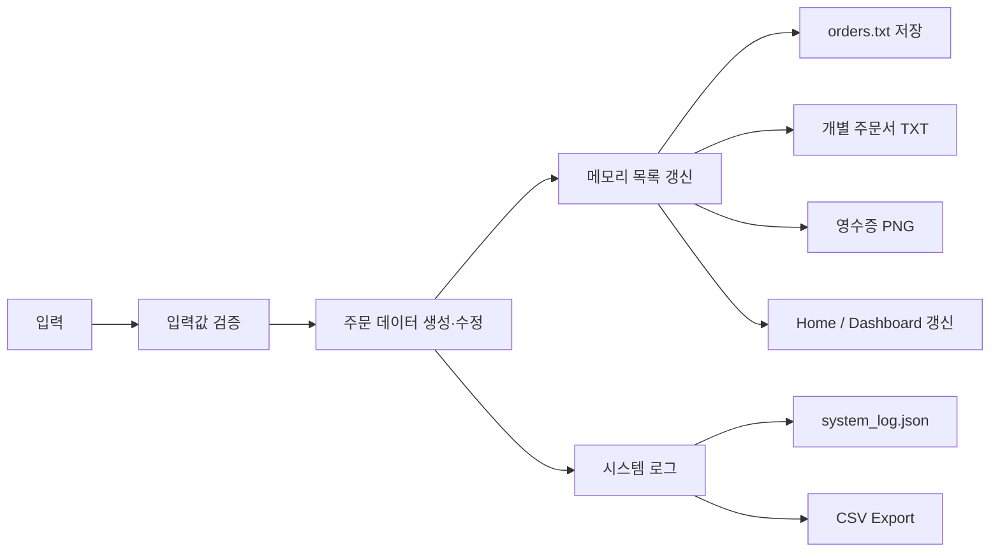
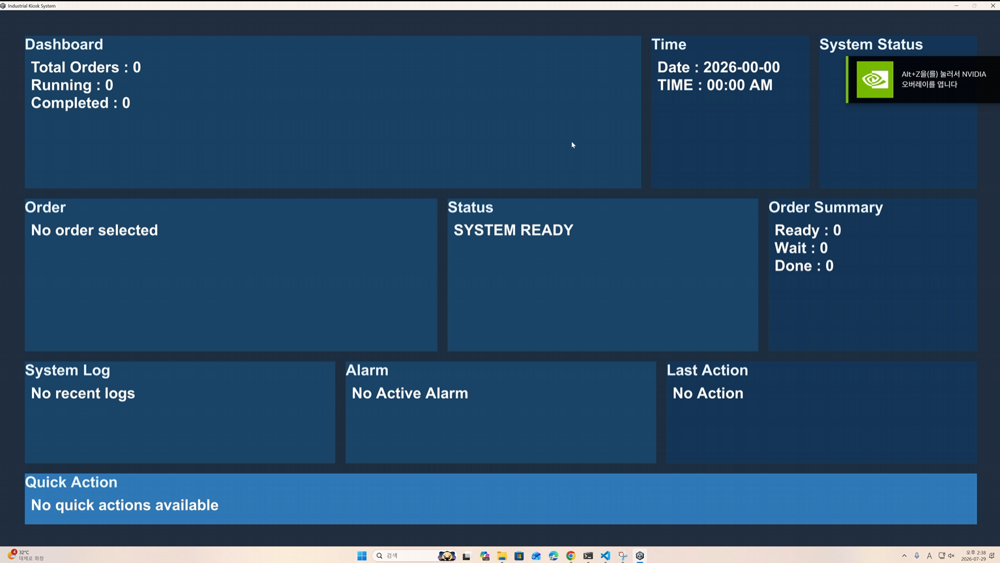
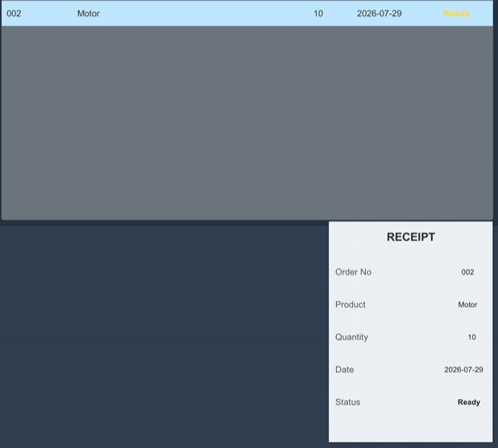

# Industrial Kiosk System

> Unity 기반 주문·상태·알람·로그 통합 관리 키오스크

<p align="center">
  
</p>

## 프로젝트 정보

| 항목 | 내용 |
|---|---|
| 개발 형태 | 교육 과정 기반 개인 프로젝트 |
| 구현 범위 | UI 설계, 주문·상태·알람·로그 기능, 로컬 파일 저장, Windows 빌드 |
| 개발 환경 | Unity 6000.3.10f1, C# |
| 실행 환경 | Windows Intel 64-bit |
| 프로젝트 상태 | 주요 기능 구현 및 Windows 독립 실행형 빌드 검증 완료 |

## 프로젝트 개요

산업 현장에서 주문, 시스템 상태, 알람과 작업 로그를 하나의 화면에서 관리하는 흐름을 구현한 Unity 기반 키오스크입니다. Home과 Dashboard에서 주요 정보를 요약하고, 각 Detail 화면에서 주문 생성·조회·수정·삭제, 상태 변경, 테스트 알람과 로그 조회를 처리합니다.

주문과 로그는 `Application.persistentDataPath` 아래에 TXT·JSON·CSV 형식으로 저장하며, 선택한 주문은 영수증 UI를 PNG로 출력합니다. Windows 독립 실행형 빌드 환경에서 데이터 저장과 재실행 후 주문 복원까지 확인했습니다.

## 데모

### 산업용 키오스크 전체 기능 시연

Windows 독립 실행형 빌드 환경에서 주문 등록·수정·삭제, 시스템 상태 변경, 테스트 알람, 로그 조회, TXT·JSON·CSV 데이터 저장, 영수증 PNG 출력과 재실행 후 주문 데이터 복원 흐름을 확인할 수 있습니다.

https://github.com/user-attachments/assets/6395205a-398a-4b4d-800e-a7682d0c1225

## 주요 기능

### Home 및 Dashboard

주문 수량, 시스템 상태, 최근 알람과 최근 로그를 요약합니다. Side Menu와 바로가기 버튼을 통해 각 Detail 화면으로 이동합니다.

<table>
  <tr>
    <td width="50%"></td>
    <td width="50%"></td>
  </tr>
  <tr>
    <td align="center">Home</td>
    <td align="center">Dashboard</td>
  </tr>
</table>

### 주문 관리 및 영수증 출력

주문 추가·수정·삭제, 주문번호 자동 생성과 중복 방지, 제품명·수량·날짜 입력 검증을 처리합니다. 저장된 주문은 개별 TXT 주문서와 PNG 영수증으로 출력합니다.

<table>
  <tr>
    <td width="50%"></td>
    <td width="50%"></td>
  </tr>
  <tr>
    <td align="center">주문 관리</td>
    <td align="center">영수증 PNG 출력</td>
  </tr>
</table>

### 시스템 상태 및 테스트 알람

시스템 상태를 `READY`, `RUNNING`, `ERROR`로 변경하고 Home·Dashboard·Bottom Bar에 반영합니다. 알람 화면은 외부 설비 연동 전 UI 검증을 위한 테스트 알람 생성, 상세 조회와 전체 삭제 기능을 제공합니다.

<table>
  <tr>
    <td width="50%"></td>
    <td width="50%"></td>
  </tr>
  <tr>
    <td align="center">시스템 상태 관리</td>
    <td align="center">테스트 알람 관리</td>
  </tr>
</table>

### 시스템 로그

주문·상태·알람 변경 이력을 최신순으로 표시하고 카테고리별로 필터링합니다. 로그는 JSON으로 저장하며 필요할 때 CSV 파일로 내보냅니다.

<p align="center">
  
</p>

## 시스템 구성



- `scr_PageRouter`: Home·Detail 화면 전환과 공통 네비게이션
- Page Controllers: 화면 입력, 검증, 선택 상태와 UI 갱신
- Domain Controllers: 주문·상태·알람·Dashboard 데이터 처리
- Data/File Layer: TXT·JSON·CSV 저장과 재실행 복원
- UI Components: 주문·알람·로그 Row와 공통 상태 표시

자세한 구성은 [시스템 아키텍처](docs/02-architecture.md)에서 확인할 수 있습니다.

## 데이터 흐름



런타임 데이터는 `Application.persistentDataPath/KioskData` 아래에 저장됩니다. 자세한 저장 구조와 처리 순서는 [데이터 흐름](docs/04-data-flow.md)에 정리했습니다.

## 기술 스택

| 구분 | 기술 |
|---|---|
| Engine | Unity 6000.3.10f1 |
| Language | C# |
| UI | Unity uGUI |
| Serialization | Newtonsoft Json 3.2.2 |
| 데이터·출력 | TXT, JSON, CSV 저장 / PNG 출력 |
| Target | Windows Intel 64-bit |

## 실행 환경

- Unity Editor: `6000.3.10f1`
- Build Target: Windows Intel 64-bit
- Main Scene: `Assets/Kiosk/Scenes/Kiosk_Industrial.unity`
- Development Build: Off
- Script Debugging: Off

## 실행 방법

1. Unity Hub에서 저장소 폴더를 엽니다.
2. `Assets/Kiosk/Scenes/Kiosk_Industrial.unity` Scene을 엽니다.
3. Console Error가 없는지 확인한 뒤 Play Mode에서 기능을 확인합니다.
4. Windows 실행 파일은 `File > Build Profiles > Windows`에서 `Intel 64-bit`로 빌드합니다.
5. 생성된 실행 파일을 실행하고 저장·복원 동작을 확인합니다.

## 검증 결과

| 검증 항목 | 결과 | 확인 내용 |
|---|---|---|
| 화면 전환 | PASS | Home과 각 Detail 화면 이동 및 복귀 |
| 주문 생성·조회·수정·삭제 | PASS | 추가·수정·선택 삭제·마지막 주문 삭제 |
| 입력 검증 | PASS | 제품명·수량·날짜 및 주문번호 중복 검사 |
| TXT 저장 | PASS | Master 주문 목록과 개별 주문서 생성 |
| 영수증 PNG | PASS | 선택 주문 데이터 반영 및 파일 생성 |
| 상태 관리 | PASS | READY·RUNNING·ERROR 변경 및 공통 UI 반영 |
| 테스트 알람 | PASS | 생성·선택·상세 조회·전체 삭제 |
| 로그 관리 | PASS | 카테고리 필터, JSON 저장, CSV Export |
| 데이터 복원 | PASS | 프로그램 재실행 후 주문 목록 복원 |
| Windows Build | PASS | Intel 64-bit Standalone 실행 확인 |

<table>
  <tr>
    <td width="50%"></td>
    <td width="50%"></td>
  </tr>
  <tr>
    <td align="center">Windows 독립 실행형 빌드 검증</td>
    <td align="center">주문 등록 검증</td>
  </tr>
  <tr>
    <td width="50%"></td>
    <td width="50%"></td>
  </tr>
  <tr>
    <td align="center">영수증 PNG 저장</td>
    <td align="center">로컬 데이터 파일 생성</td>
  </tr>
</table>

세부 테스트 항목은 [검증 결과](docs/05-validation.md)에 정리했습니다.

## 프로젝트 구조

```text
Assets/Kiosk
├─ Docs
├─ Prefab
│  ├─ Background
│  ├─ Canvas_Main
│  ├─ Common
│  ├─ MainFrame
│  ├─ Main_UI
│  ├─ Page
│  └─ UI_Root
├─ Scenes
│  └─ Kiosk_Industrial.unity
└─ Scripts
   ├─ Data
   ├─ Pages
   └─ UI
```

주요 클래스와 Prefab 구성은 [프로젝트 구조](docs/07-project-structure.md)에서 확인할 수 있습니다.

## 문제 해결 및 최종 구현 범위

주문번호 중복, 잘못된 입력값 저장, 실행 종료 후 데이터 복원과 빌드 환경의 파일 경로 차이를 처리했습니다. 최종적으로 주문 생성·조회·수정·삭제, TXT 저장·복원, 영수증 PNG 생성, JSON 로그와 CSV 내보내기 기능을 Windows 독립 실행형 빌드에서 확인했습니다.

자세한 내용은 [문제 해결 및 최종 구현 범위](docs/06-project-scope.md)에서 확인할 수 있습니다.
## 상세 문서

| 문서 | 내용 |
|---|---|
| [Documentation](docs/README.md) | 상세 문서 전체 목차 |
| [01. Overview](docs/01-overview.md) | 개발 목적과 구현 범위 |
| [02. Architecture](docs/02-architecture.md) | 시스템 계층과 주요 컴포넌트 |
| [03. Features](docs/03-features.md) | 화면별 기능과 동작 |
| [04. Data Flow](docs/04-data-flow.md) | 데이터 처리와 파일 저장 구조 |
| [05. Validation](docs/05-validation.md) | 테스트 환경과 검증 결과 |
| [06. 문제 해결 및 최종 구현 범위](docs/06-project-scope.md) | 현재 범위와 개선 방향 |
| [07. Project Structure](docs/07-project-structure.md) | 폴더·Prefab·스크립트 구성 |

## 외부 리소스 및 라이선스

이 저장소는 포트폴리오 검토를 목적으로 공개합니다. Unity, Newtonsoft Json과 외부 리소스의 권리는 각 제작자 및 배포처의 라이선스를 따릅니다. 프로젝트 코드와 문서에는 별도의 오픈소스 라이선스를 부여하지 않았습니다.
