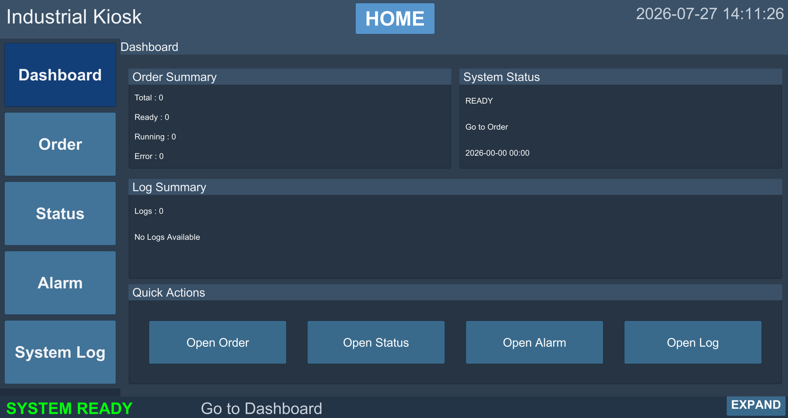

# Industrial Kiosk System

Unity와 C#으로 구현한 주문·상태·알람·로그 통합 산업용 키오스크 시스템입니다.

<p align="center">
  
</p>

## 프로젝트 개요

- **프로젝트명**: Industrial Kiosk System
- **개발 환경**: Unity / C#
- **목표**: 산업 현장에서 사용할 수 있는 주문·상태·알람·로그 통합 UI 구현
- **핵심 방향**: UI와 데이터 처리 분리, 파일 기반 데이터 영속성, 반복 UI 프리팹화, 제출 환경에서도 안정적으로 동작하는 경량 구조
- **빌드 결과**: Windows Intel 64-bit 빌드 성공

단순한 화면 구성에 그치지 않고 주문 데이터와 시스템 로그를 로컬 파일로 저장하고, 앱 재실행 시 주문을 복원할 수 있도록 구현했습니다. 공통 UI는 `TopBar`, `SideMenu`, `MainFrame`, `BottomBar` 구조로 구성했습니다.

## 핵심 기능

- Page Router 기반 Home / Detail 화면 전환
- 주문 추가 / 수정 / 삭제 및 주문 상태 관리
- 주문번호 자동 생성 및 중복 방지
- 제품명 / 수량 / 날짜 입력 검증
- TXT 기반 주문 저장 및 불러오기
- 개별 주문서 TXT 출력
- 주문 데이터를 반영한 영수증 PNG 저장
- READY / RUNNING / ERROR 시스템 상태 변경 및 Dashboard 연동
- 알람 생성, 목록 표시, 상세 조회, 전체 삭제
- 주문 / 상태 / 알람 변경 중심의 시스템 로그
- 로그 카테고리 필터, JSON 저장, CSV Export
- Dashboard 및 Home 카드의 주문·상태·알람·로그 요약 표시

## 주요 화면

### Home

주문 요약과 시스템 상태를 한눈에 확인하고, 최근 알람과 마지막 동작을 조회할 수 있는 시작 화면입니다.

<p align="center">
  
</p>

### Dashboard

전체 주문 수와 상태별 수량, 현재 시스템 상태를 요약합니다. 최근 로그와 알람도 함께 표시합니다.

<p align="center">
  
</p>

### Order Management

주문을 추가·수정·삭제하고 주문 상태를 관리합니다. 제품명, 수량, 날짜를 검증하며 주문번호를 자동 생성하고 중복을 방지합니다.

<p align="center">
  
</p>

### Receipt Export

선택한 주문 데이터를 영수증 UI에 반영하고 주문별 PNG 파일로 저장합니다.

<p align="center">
  
</p>

### Alarm Management

알람을 생성해 목록으로 표시하고 선택한 알람의 상세 내용을 조회합니다. 등록된 알람은 전체 삭제할 수 있습니다.

<p align="center">
  
</p>

### System Status

시스템 상태를 READY, RUNNING, ERROR로 변경하고 변경 결과를 Dashboard와 공통 상태 영역에 연동합니다.

<p align="center">
  
</p>

### System Log

주문, 상태, 알람 변경 이력을 기록하고 카테고리별로 필터링합니다. 로그는 JSON으로 저장하며 CSV 파일로 내보낼 수 있습니다.

<p align="center">
  
</p>

## 시스템 아키텍처

```text
UI Layer
├─ scr_PageOrderController
├─ scr_PageLogController
└─ scr_PageRouter

Controller Layer
├─ scr_OrderController
├─ scr_DashboardController
├─ scr_StatusController
├─ scr_AlarmController
└─ scr_ReceiptCapture

Data / File Layer
├─ OrderData
├─ LogData
├─ scr_LogFileSave
├─ NST_Json
└─ NST_CSV

UI Component Layer
├─ scr_OrderListItemUI
├─ scr_LogRowUI
├─ scr_AlarmRowUI
├─ scr_UIActionLogger
├─ scr_BottomBarToggle
└─ scr_TimeDisplay
```

Page Router가 Home과 각 Detail 페이지의 전환 및 공통 네비게이션을 담당합니다. 화면 Controller, 데이터 및 파일 처리, 반복 Row UI의 책임을 나누어 주문·로그 데이터와 화면 표시가 분리되도록 구성했습니다.

## 데이터 저장 구조

모든 런타임 데이터는 Unity가 운영체제별 쓰기 가능한 경로로 제공하는 `Application.persistentDataPath` 아래의 `KioskData`에 저장됩니다.

```text
KioskData
├─ Orders
│  ├─ orders.txt
│  ├─ OrderSheets
│  │  └─ OrderSheet_{OrderNo}.txt
│  └─ Receipts
│     └─ Receipt_{OrderNo}.png
└─ Logs
   ├─ system_log.json
   └─ system_log_export_YYYYMMDD_HHMMSS.csv
```

Windows 환경에서는 일반적으로 다음 경로에 저장됩니다.

```text
C:\Users\<UserName>\AppData\LocalLow\<CompanyName>\<ProductName>\KioskData
```

## 성능 및 안정화

- 페이지 이동과 단순 클릭 로그를 제거하고 실제 데이터가 변경된 경우만 기록
- 로그 UI 표시 수 제한
- 메모리 로그 및 JSON 저장 로그 수 제한
- 새 로그 1건만 UI 상단에 추가하는 방식 적용
- `TimeDisplay`를 매 프레임이 아닌 1초 단위로 갱신
- 영수증 PNG 저장 후 임시 Texture 메모리 해제
- 반복되는 주문·알람·로그 Row UI를 Prefab으로 생성
- `Application.persistentDataPath`를 사용해 실행 위치와 무관한 저장 경로 확보

## 테스트 결과

| 구분 | 테스트 항목 | 결과 |
|---|---|---|
| Navigation | Home / Detail 페이지 전환 | PASS |
| Order | 주문 추가 / 수정 / 삭제 | PASS |
| Order | 주문번호 자동 생성 / 중복 방지 | PASS |
| Storage | 주문 데이터 `orders.txt` 저장 | PASS |
| Storage | 개별 주문서 TXT 저장 | PASS |
| Receipt | 영수증 PNG 저장 | PASS |
| Status | READY / RUNNING / ERROR 상태 변경 | PASS |
| Alarm | 생성 / 목록 / 상세 조회 / 전체 삭제 | PASS |
| Log | 카테고리 필터 | PASS |
| Log | JSON 저장 | PASS |
| Log | CSV Export | PASS |
| Persistence | 앱 재실행 후 주문 복원 | PASS |
| Dashboard | 주문 / 상태 / 알람 / 로그 요약 | PASS |
| Build | Windows Intel 64-bit 빌드 | PASS |

## 실행 방법

1. Unity에서 `Assets/Kiosk/Scenes/Kiosk_Industrial` Scene을 엽니다.
2. Console Error가 없는지 확인합니다.
3. `File > Build Profiles > Windows`에서 `Intel 64-bit`로 빌드합니다.
4. 생성된 `Industrial Kiosk System.exe`를 실행합니다.

## 프로젝트 폴더 구조

```text
Assets/Kiosk
├─ Docs
├─ Prefab
│  ├─ Background
│  ├─ Buttons
│  ├─ Card
│  ├─ Common
│  ├─ Panels
│  └─ Txt
├─ Scenes
│  └─ Kiosk_Industrial
└─ Scripts
   ├─ Data
   ├─ Pages
   └─ UI
```

## 기술 포인트

- Unity / C# 기반 Windows 데스크톱 애플리케이션
- Page Router 기반 화면 전환 구조
- UI / 데이터 / 파일 저장 책임 분리
- `Application.persistentDataPath` 기반 데이터 영속성
- 입력 검증, 주문번호 자동 생성 및 중복 방지
- Prefab 기반 동적 Row 리스트 UI
- TXT / JSON / CSV / PNG 복합 파일 출력
- 표시·메모리·저장 수를 제한한 로그 보관 정책
- Windows Intel 64-bit 환경의 실제 저장 및 재실행 테스트

## 상세 문서

- [01. 프로젝트 개요](docs/01-project-overview.md)
- [02. 시스템 아키텍처](docs/02-architecture.md)
- [03. 기능 설명](docs/03-features.md)
- [04. 데이터 및 저장 구조](docs/04-data-and-storage.md)
- [05. 최종 테스트 결과](docs/05-test-report.md)
- [06. 프로젝트 구조](docs/06-project-structure.md)
- [07. 개발 이력](docs/07-development-history.md)
- [08. 포트폴리오 설명](docs/08-portfolio.md)

## 포트폴리오 및 면접 설명

### 포트폴리오 한 줄 소개

> Unity 기반 산업용 키오스크 시스템을 설계하고, 주문·상태·알람·로그 기능과 파일 기반 데이터 영속성, 영수증 이미지 출력을 구현한 프로젝트입니다.

### 면접 설명

이 프로젝트는 단순한 UI 시안이 아니라 데이터를 저장하고 다시 불러오는 산업용 키오스크 흐름을 구현한 프로젝트입니다. 주문 관리, 상태 변경, 알람, 시스템 로그를 하나의 화면에 통합하고 UI와 데이터 저장 책임을 분리했습니다. 또한 의미 있는 데이터 변경만 로그로 기록하고 표시·메모리·저장 수를 제한해 로그 누적에 따른 부담을 줄였으며, Windows Intel 64-bit 빌드에서 저장과 재실행 복원까지 검증했습니다.
