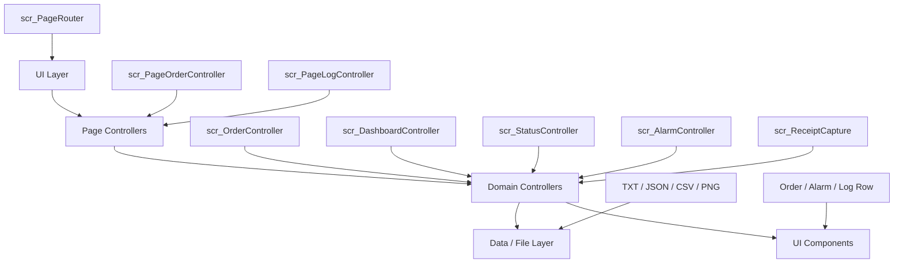

# 02. 시스템 아키텍처

## 전체 구조



## 계층별 역할

### UI Layer

`scr_PageRouter`가 Home과 Detail 화면 전환, Side Menu 선택 상태와 공통 네비게이션을 처리합니다. `TopBar`, `MainFrame`, `BottomBar`는 각 화면에서 공통으로 사용하는 영역입니다.

### Page Controllers

화면 입력, 선택 상태와 UI 표시를 담당합니다.

- `scr_PageOrderController`: 주문 입력값 수집, 검증, 추가·수정·삭제 요청
- `scr_PageLogController`: 최신 로그 Row, 필터, Summary·Detail, CSV Export

### Domain Controllers

화면과 데이터 사이의 주요 로직을 담당합니다.

- `scr_OrderController`: 주문 목록, 검색, 번호 생성, TXT 저장·복원
- `scr_DashboardController`: 주문·상태·알람·로그 요약
- `scr_StatusController`: READY·RUNNING·ERROR 상태와 공통 UI 갱신
- `scr_AlarmController`: 테스트 알람 목록과 선택 상태
- `scr_ReceiptCapture`: 주문 데이터를 영수증 UI에 반영하고 PNG 저장

### Data / File Layer

- `OrderData`: 주문번호, 제품명, 수량, 날짜, 상태와 생성 시간
- `LogData`: 시간, 카테고리, Summary와 Detail
- `scr_LogFileSave`: 로그 저장 경로 관리
- `NST_Json`: Newtonsoft Json 기반 직렬화·역직렬화
- `NST_CSV`: 로그 CSV 생성

### UI Components

- `scr_OrderListItemUI`: 주문 Row 표시와 선택
- `scr_AlarmRowUI`: 알람 Row 표시와 선택
- `scr_LogRowUI`: 로그 Row 표시
- `scr_BottomBarToggle`: 공통 상태 영역 표시
- `scr_TimeDisplay`: 날짜와 시간을 1초 주기로 갱신
- `scr_UIActionLogger`: UI 동작 중 필요한 로그 연결

## Prefab 구성

```text
Assets/Kiosk/Prefab
├─ Background
│  └─ Background.prefab
├─ Canvas_Main
│  ├─ Canvas_Main.prefab
│  ├─ OrderController.prefab
│  └─ PageManager.prefab
├─ Common
│  ├─ PF_ActionButton_Large.prefab
│  ├─ PF_ActionButton_Small.prefab
│  ├─ PF_AlarmRow.prefab
│  ├─ PF_LogRow.prefab
│  ├─ PF_OrderRow.prefab
│  ├─ PF_Receipt.prefab
│  └─ 공통 Button·Panel·Card Prefab
├─ MainFrame
│  └─ MainFrame.prefab
├─ Main_UI
│  ├─ TopBar.prefab
│  ├─ SideMenu.prefab
│  ├─ Home.prefab
│  ├─ BottomBar.prefab
│  └─ Main_UI.prefab
├─ Page
│  ├─ Page_Dashboard.prefab
│  ├─ Page_Order.prefab
│  ├─ Page_Status.prefab
│  ├─ Page_Alarm.prefab
│  └─ Page_SystemLog.prefab
└─ UI_Root
   └─ UI_Root.prefab
```

공통 요소뿐 아니라 `UI_Root`, Main UI와 각 Detail Page도 Prefab으로 구성되어 있습니다. Scene에서는 이 Prefab 구조를 기준으로 화면을 조합합니다.

## 설계 기준

- 화면 입력과 데이터 저장 책임을 분리
- 반복 Row는 Prefab으로 생성
- Home·Dashboard 요약은 Controller 데이터에서 갱신
- 런타임 저장 경로는 `Application.persistentDataPath`로 통일
- 페이지 이동이나 단순 선택보다 실제 데이터 변경을 중심으로 로그 기록

---

[문서 목차](README.md) · [프로젝트 README](../README.md)
