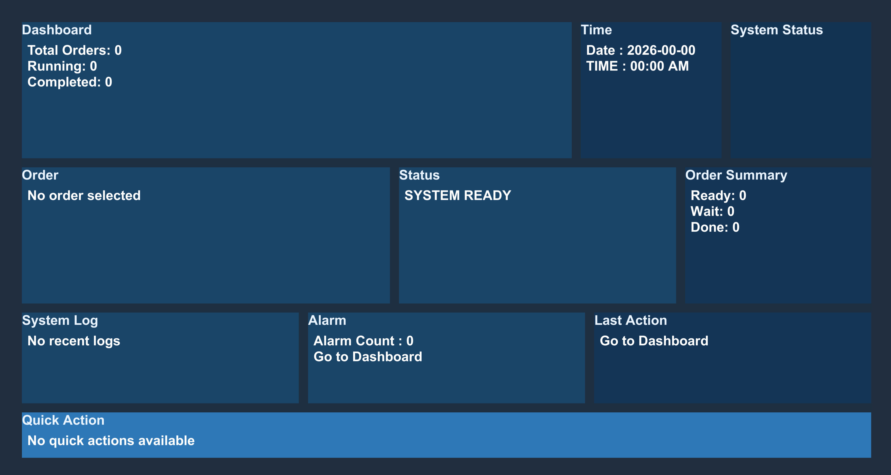
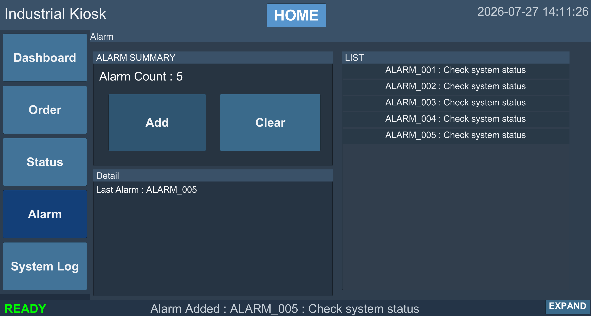

# 03. Features

## Home

Home 화면은 프로젝트 진입점이며 주문, 상태, 최근 알람과 마지막 동작을 요약합니다. 각 카드와 Side Menu를 통해 Detail 화면으로 이동할 수 있습니다.

  

## Dashboard

Dashboard는 전체 주문 수, 상태별 주문 수량, 현재 시스템 상태, 최근 로그와 최근 알람을 한 화면에 표시합니다.

  

## Order

### 주문 처리

- 주문 추가·수정
- 선택 주문 삭제
- 마지막 주문 삭제
- 주문 선택 해제
- 오늘 날짜 자동 입력

### 입력 검증

- 주문번호 자동 생성
- 주문번호 중복 방지
- 제품명 공백 검사
- 수량 양의 정수 검사
- 날짜 형식 검사

### 파일 출력

- 전체 주문 목록 `orders.txt`
- 주문별 `OrderSheet_{OrderNo}.txt`
- 주문별 `Receipt_{OrderNo}.png`

<table>
  <tr>
    <td width="50%" align="center"></td>
    <td width="50%" align="center"></td>
  </tr>
  <tr>
    <td align="center">주문 관리</td>
    <td align="center">영수증 PNG 출력</td>
  </tr>
</table>

## Status

시스템 상태를 `READY`, `RUNNING`, `ERROR`로 변경합니다. 선택한 상태는 Status 화면, Bottom Bar, Home과 Dashboard에 반영되고 로그에 기록됩니다.

  

## Alarm

외부 설비 연동 전 알람 UI와 데이터 흐름을 확인하기 위한 테스트 알람 기능입니다.

- 테스트 알람 생성
- 알람 Row 목록 표시
- 선택 알람 상세 조회
- 전체 알람 삭제
- Home과 Dashboard 최근 알람 반영

  

## System Log

주문, 시스템 상태와 테스트 알람의 변경 이력을 기록합니다.

- 최신 로그 우선 표시
- Order·Status·Alarm 카테고리 필터
- Summary와 Detail 표시
- JSON 자동 저장·복원
- CSV 수동 Export
- 화면 15건, 메모리·저장 파일 30건 유지

  

## Dashboard 연동

주문, 상태, 알람 또는 로그가 변경되면 관련 Controller가 Home과 Dashboard의 요약 값을 갱신합니다. 각 화면이 별도의 임의 값을 만들지 않고 현재 메모리 데이터를 기준으로 표시합니다.

---

[문서 목차](README.md) · [프로젝트 README](../README.md)
