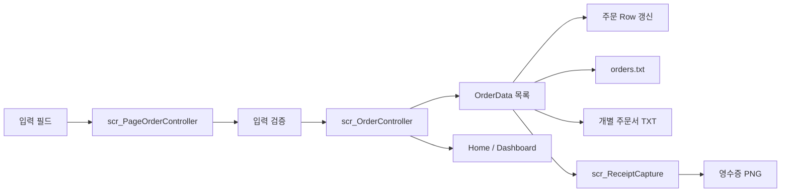
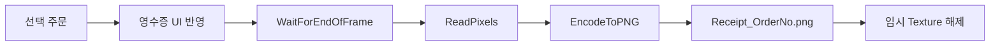
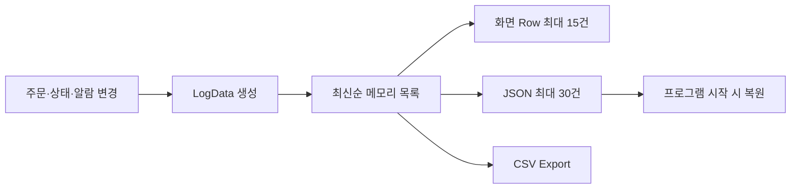

# 04. 데이터 흐름

## 기준 저장 경로

모든 런타임 데이터는 Unity가 운영체제별 쓰기 가능한 경로로 제공하는 `Application.persistentDataPath`를 기준으로 저장합니다.

Windows에서는 일반적으로 다음 구조 아래에 생성됩니다.

```text
C:\Users\<UserName>\AppData\LocalLow\<CompanyName>\<ProductName>\KioskData
```

## 저장 폴더 구조

```text
KioskData
├─ Orders
│  ├─ orders.txt
│  ├─ OrderSheets
│  │  └─ OrderSheet_{OrderNo}.txt
│  └─ Receipts
│     └─ Receipt_{OrderNo}.png
└─ Logs
   ├─ system_log.json
   └─ system_log_export_YYYYMMDD_HHMMSS.csv
```

## 주문 데이터 흐름



### 추가·수정·삭제

1. `scr_PageOrderController`가 입력 필드 값을 수집합니다.
2. 제품명, 수량, 날짜와 주문번호를 검증합니다.
3. `scr_OrderController`가 메모리의 주문 목록을 변경합니다.
4. 주문 Row와 Home·Dashboard 요약을 갱신합니다.
5. Master TXT와 필요한 개별 파일을 저장합니다.
6. 변경 내역을 시스템 로그에 기록합니다.

### 프로그램 시작

1. `scr_OrderController`가 `orders.txt` 존재 여부를 확인합니다.
2. 저장된 각 행을 `OrderData`로 변환합니다.
3. 주문 목록과 Row를 복원합니다.
4. Home과 Dashboard 요약을 갱신합니다.

## 영수증 PNG 흐름



`scr_ReceiptCapture`가 지정된 `RectTransform` 영역을 캡처합니다. PNG 저장 후 생성한 Texture를 해제해 반복 저장 시 임시 메모리가 누적되지 않도록 처리합니다.

## 로그 데이터 흐름



페이지 이동과 단순 Row 선택은 로그 대상에서 제외하고 실제 데이터 변경을 중심으로 기록합니다.

## 파일별 역할

| 파일 | 역할 | 생성 시점 |
|:---|:---|:---|
| `orders.txt` | 전체 주문 Master 데이터 | 주문 추가·수정·삭제 후 |
| `OrderSheet_{OrderNo}.txt` | 주문별 상세 정보 | 주문 저장·수정 후 |
| `Receipt_{OrderNo}.png` | 선택 주문 영수증 | 영수증 출력 시 |
| `system_log.json` | 최근 시스템 로그 | 로그 추가 후 |
| `system_log_export_*.csv` | 로그 내보내기 | 사용자가 Export 실행 시 |

---

[문서 목차](README.md) · [프로젝트 README](../README.md)
