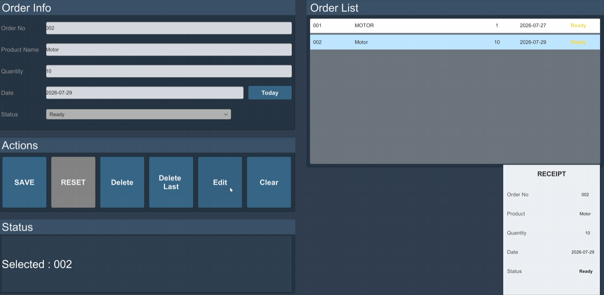
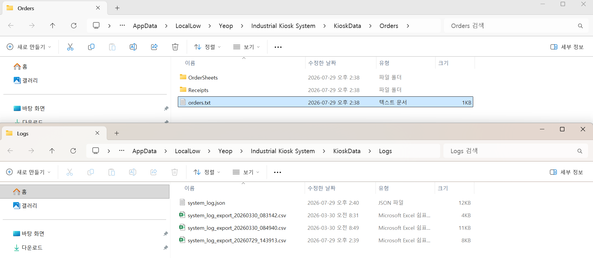

# 05. 검증 결과

## 테스트 환경

| 항목 | 내용 |
|:---|:---|
| Unity | 6000.3.10f1 |
| Platform | Windows |
| Architecture | Intel 64-bit |
| Development Build | Off |
| Script Debugging | Off |
| Main Scene | `Assets/Kiosk/Scenes/Kiosk_Industrial.unity` |

## 기능 검증

| 영역 | 검증 항목 | 결과 |
|:---|:---|:---:|
| Navigation | Home에서 각 Detail 화면 이동 | PASS |
| Navigation | Detail 화면에서 Home 복귀 | PASS |
| Order | 주문 추가·수정·선택 삭제 | PASS |
| Order | 마지막 주문 삭제 | PASS |
| Order | 주문번호 자동 증가와 중복 방지 | PASS |
| Validation | 제품명·수량·날짜 입력 검사 | PASS |
| Storage | `orders.txt` 생성 | PASS |
| Storage | 개별 주문서 TXT 생성 | PASS |
| Receipt | 영수증 PNG 생성 | PASS |
| Status | READY·RUNNING·ERROR 변경 | PASS |
| Alarm | 테스트 알람 생성·선택·전체 삭제 | PASS |
| Log | Order·Status·Alarm 로그 기록 | PASS |
| Log | 카테고리 필터 | PASS |
| Log | JSON 저장과 CSV Export | PASS |
| Dashboard | 주문·상태·알람·로그 요약 | PASS |
| Persistence | 프로그램 재실행 후 주문 복원 | PASS |
| Build | Windows Intel 64-bit 실행 | PASS |

## 검증 화면

### Windows 독립 실행형 빌드 검증

Unity Editor가 아닌 Windows 실행 파일에서 주요 UI와 기능을 확인했습니다.

<p align="center">
  
</p>

### 주문 등록

주문 입력 후 목록과 관련 요약 정보가 갱신되는지 확인했습니다.

<p align="center">
  
</p>

### 영수증 PNG 저장

선택한 주문 데이터가 영수증 UI에 반영되고 PNG 파일로 생성되는지 확인했습니다.

<p align="center">
  
</p>

### 로컬 데이터 파일 생성

주문 TXT, 로그 JSON·CSV와 영수증 PNG가 `KioskData` 하위 폴더에 생성되는지 확인했습니다.

<p align="center">
  
</p>

## 빌드 오류 수정

Windows Build 과정에서 `NST_Json.cs`가 `File`, `Path`, `Directory`를 사용할 때 `System.IO` 네임스페이스가 누락된 오류를 확인했습니다.

```csharp
using System.IO;
```

네임스페이스를 추가한 뒤 컴파일 오류를 해결하고 Windows Build를 완료했습니다.

## 검증 범위

Windows 독립 실행형 빌드에서 포트폴리오 규모의 주문 데이터를 기준으로 주요 UI, 주문 저장·복원, 영수증 생성과 내보내기 기능을 검증했습니다.

---

[문서 목차](README.md) · [프로젝트 README](../README.md)
